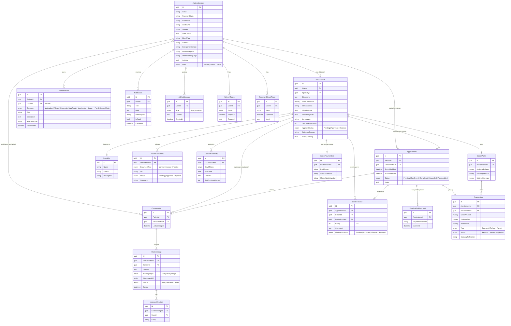

# Figure 1 — Entity Relationship Diagram (ERD)

ERD of the SQL Server schema used by the Find Your Clinic backend. Every box is a real
EF Core entity / DbSet in `FindYourClinic.Infrastructure/Persistence/ApplicationDbContext.cs`.
Audit columns (`CreatedAt`, `UpdatedAt`, soft-delete flags) and Identity-internal columns
are omitted for readability.

