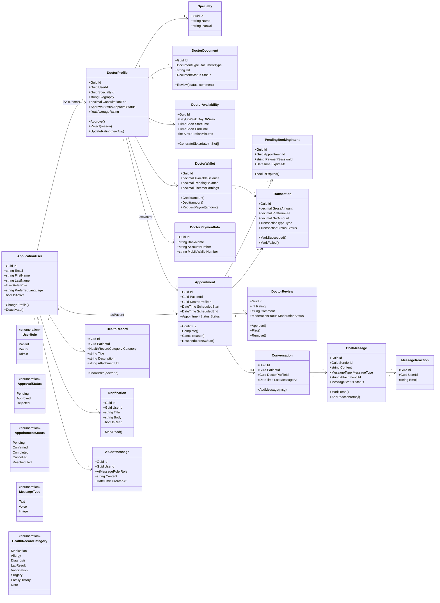

# Figure 2 — UML Class Diagram

UML class diagram of the core domain model under
`Backend/src/FindYourClinic.Domain/Entities/`. The diagram emphasises the relationships
and a small subset of methods relevant to the domain rules (status transitions, wallet
operations). Identity infrastructure types and EF-Core internals are intentionally hidden.

