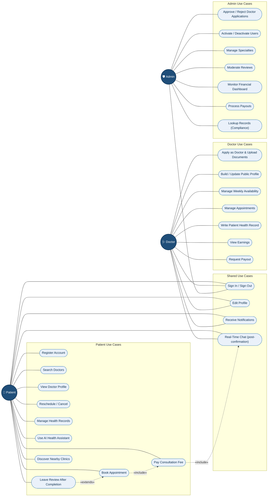

# Figure 3 — Use Case Diagram

Use-case diagram showing what each of the three actors (Patient, Doctor, Admin) can do
in Find Your Clinic. Mermaid does not have a dedicated UML use-case syntax, so this is
modelled as a labelled flowchart with rounded "use case" nodes grouped per actor.

