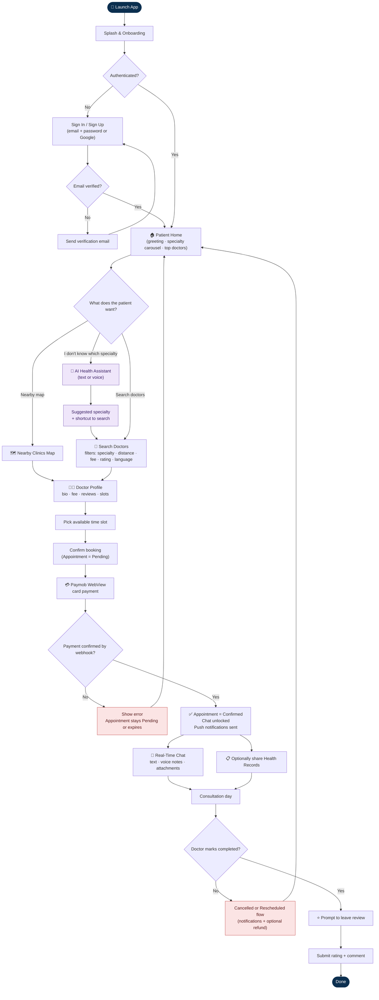

# Figure 4 — Patient Workflow Diagram

End-to-end patient journey through Find Your Clinic, from opening the app to leaving a
review after a completed consultation.

```mermaid
flowchart TD
    Start([📱 Launch App]) --> Splash["Splash & Onboarding"]
    Splash --> AuthCheck{Authenticated?}
    AuthCheck -- No --> SignIn["Sign In / Sign Up<br/>(email + password or Google)"]
    SignIn --> Verify{Email verified?}
    Verify -- No --> ResendEmail["Send verification email"] --> SignIn
    Verify -- Yes --> Home
    AuthCheck -- Yes --> Home["🏠 Patient Home<br/>(greeting · specialty carousel · top doctors)"]

    Home --> ChooseFlow{What does the patient want?}

    %% AI assistance path
    ChooseFlow -- "I don't know which specialty" --> AI["🤖 AI Health Assistant<br/>(text or voice)"]
    AI --> AISpecialty["Suggested specialty<br/>+ shortcut to search"]
    AISpecialty --> Search

    %% Direct search path
    ChooseFlow -- "Search doctors" --> Search["🔎 Search Doctors<br/>filters: specialty · distance · fee · rating · language"]
    ChooseFlow -- "Nearby map" --> Map["🗺️ Nearby Clinics Map"]
    Map --> Profile
    Search --> Profile["👨‍⚕️ Doctor Profile<br/>bio · fee · reviews · slots"]

    Profile --> PickSlot["Pick available time slot"]
    PickSlot --> Booking["Confirm booking<br/>(Appointment = Pending)"]
    Booking --> Pay["💳 Paymob WebView<br/>card payment"]
    Pay --> PayOk{Payment confirmed by webhook?}
    PayOk -- No --> PayFail["Show error<br/>Appointment stays Pending or expires"] --> Home
    PayOk -- Yes --> Confirmed["✅ Appointment = Confirmed<br/>Chat unlocked<br/>Push notifications sent"]

    Confirmed --> Chat["💬 Real-Time Chat<br/>text · voice notes · attachments"]
    Confirmed --> Records["📋 Optionally share Health Records"]

    Chat --> ConsultDay["Consultation day"]
    Records --> ConsultDay

    ConsultDay --> Completed{Doctor marks completed?}
    Completed -- No --> Cancelled["Cancelled or Rescheduled flow<br/>(notifications + optional refund)"] --> Home
    Completed -- Yes --> ReviewPrompt["⭐ Prompt to leave review"]
    ReviewPrompt --> Review["Submit rating + comment"]
    Review --> End([Done])

    %% Styling
    classDef start fill:#0B2F4F,stroke:#0B2F4F,color:#fff;
    classDef ok    fill:#DCEAF7,stroke:#2E75B6,color:#0B2F4F;
    classDef bad   fill:#FBE4E4,stroke:#C44A4A,color:#5A1A1A;
    classDef ai    fill:#EFE6FA,stroke:#7B5DB5,color:#3A1F66;
    class Start,End start;
    class PayFail,Cancelled bad;
    class AI,AISpecialty ai;
```
