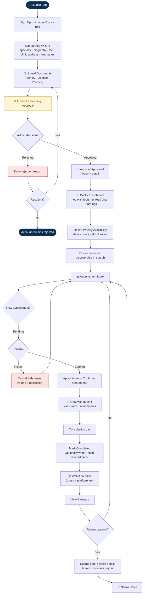

# Figure 5 — Doctor Workflow Diagram

End-to-end doctor journey, from initial registration and document upload through approval,
practising on the platform, and requesting earnings payouts.

```mermaid
flowchart TD
    Start([📱 Launch App]) --> Signup["Sign Up → choose Doctor role"]
    Signup --> Onboarding["Onboarding Wizard<br/>specialty · biography · fee · clinic address · languages"]
    Onboarding --> Docs["📎 Upload Documents<br/>(Identity · License · Practice)"]
    Docs --> Pending["⏳ Account = Pending Approval"]
    Pending --> AdminReview{Admin decision?}
    AdminReview -- "Rejected" --> Reject["Show rejection reason"] --> ResubmitDecision{Resubmit?}
    ResubmitDecision -- "Yes" --> Docs
    ResubmitDecision -- "No"  --> EndReject([Account remains rejected])
    AdminReview -- "Approved" --> Approved["✅ Account Approved<br/>Push + email"]

    Approved --> Dashboard["🏥 Doctor Dashboard<br/>today's appts · unread chat · earnings"]
    Dashboard --> Setup["Define Weekly Availability<br/>days · hours · slot duration"]
    Setup --> Live["Doctor becomes discoverable in search"]

    Live --> Inbox["📥 Appointment Inbox"]
    Inbox --> NewAppt{New appointment?}
    NewAppt -- "Pending" --> Decide{Confirm?}
    Decide -- "Reject" --> CancelDoc["Cancel with reason<br/>(refund if applicable)"] --> Inbox
    Decide -- "Confirm" --> Confirmed["Appointment = Confirmed<br/>Chat opens"]

    Confirmed --> Chat["💬 Chat with patient<br/>text · voice · attachments"]
    Chat --> Visit["Consultation day"]
    Visit --> Complete["Mark Completed<br/>Optionally write Health Record entry"]

    Complete --> Wallet["💰 Wallet credited<br/>(gross − platform fee)"]
    Wallet --> Earnings["View Earnings"]
    Earnings --> Payout{Request payout?}
    Payout -- "Yes" --> PayoutFlow["Submit bank / wallet details<br/>Admin processes payout"]
    Payout -- "No"  --> Inbox

    PayoutFlow --> Paid["✅ Status: Paid"]
    Paid --> Inbox

    %% Styling
    classDef start fill:#0B2F4F,stroke:#0B2F4F,color:#fff;
    classDef ok    fill:#DCEAF7,stroke:#2E75B6,color:#0B2F4F;
    classDef warn  fill:#FFF4D6,stroke:#C09000,color:#5A4500;
    classDef bad   fill:#FBE4E4,stroke:#C44A4A,color:#5A1A1A;
    class Start,EndReject start;
    class Pending warn;
    class Reject,CancelDoc bad;
```
