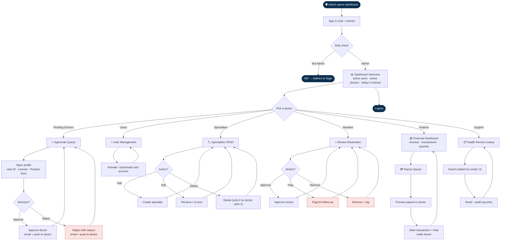

# Figure 6 — Admin Workflow Diagram

Workflow followed by a Find Your Clinic administrator inside the Next.js dashboard. The
administrator works through a set of queues (doctor approvals, flagged reviews, payout
requests, support tickets) and the diagram makes those queues explicit.

