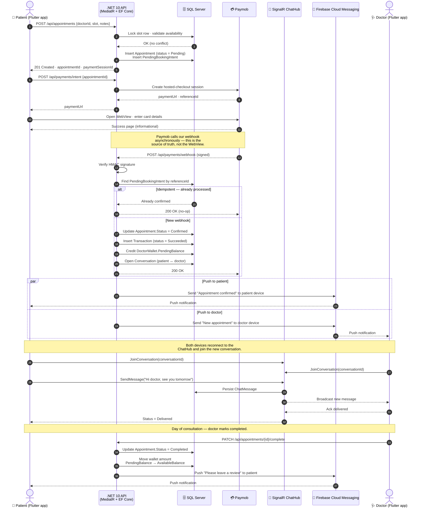

# Figure 7 — Booking and Payment Sequence Diagram

Sequence diagram of the most security-critical flow in Find Your Clinic: an end-to-end
appointment booking, payment, server-side verification, and chat unlock. The diagram
emphasises the **two-phase commit**: the appointment is created in `Pending` state,
payment is processed by Paymob, and the appointment is promoted to `Confirmed` only
after the backend independently verifies the payment through the webhook.

